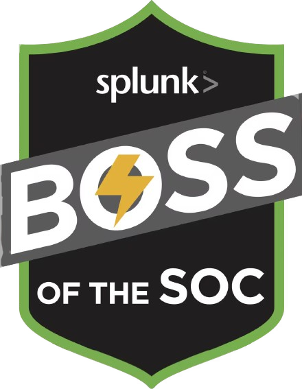

<div align="center">



# 🕵️ BOSS of the SOC — Docker

[](LICENSE)
[]()
[]()
[]()
[]()

**Run Splunk BOSS of the SOC (BOTS) datasets v1–v3 in containers with a single command.**

Based on [lexcilius/splunk-bots-docker](https://github.com/lexcilius/splunk-bots-docker) — automated installer, cross-platform.

</div>

---

## 🚀 Quick Start

```bash
# macOS / Linux
./install.sh

# Windows (PowerShell 7+)
.\install.ps1
```

That's it. The installer handles everything:

1. ✅ Checks for Docker
2. 📦 Verifies all 50+ Splunk apps & add-ons are present
3. 🔑 Prompts for an admin password
4. 🐳 Spins up the containers
5. 🎯 Prints your access URLs

```bash
# Or spin up just one version
./install.sh bots2
```

---

## 🌐 Access

| Version | URL | Scenario |
|:-------:|:---:|:---------|
| **BOTSv1** | [http://localhost:8000](http://localhost:8000) | APT + Ransomware walkthrough |
| **BOTSv2** | [http://localhost:8020](http://localhost:8020) | Advanced APT investigation |
| **BOTSv3** | [http://localhost:8030](http://localhost:8030) | Open-ended threat hunting |

**Login:** `admin` / password set during install (default: `changeme`)

---

## ⚙️ Manual Control

```bash
# Start all three
docker compose up -d

# Start a specific version
docker compose up -d bots1

# Follow logs
docker compose logs -f bots3

# Stop everything
docker compose down

# Full reset (renews 30-day license)
docker compose down && docker compose up -d
```

---

## 🎨 Customization

Override any setting in `.env` or pass environment variables:

```bash
export SPLUNK_PASSWORD="MySecur3P@ss"
export BOTS1_PORT=8080
export BOTS2_PORT=8081
export BOTS3_PORT=8082
./install.sh
```

| Variable | Default | Description |
|----------|---------|-------------|
| `SPLUNK_PASSWORD` | `changeme` | Admin password (min 8 chars) |
| `BOTS1_PORT` | `8000` | Host port for BOTSv1 |
| `BOTS2_PORT` | `8020` | Host port for BOTSv2 |
| `BOTS3_PORT` | `8030` | Host port for BOTSv3 |

---

## 📚 What's Inside

Each container comes pre-loaded with the relevant Splunk apps, technology add-ons, and investigation walkthroughs:

**BOTSv1** — Fortinet, Sysmon, Windows, Stream, Suricata, Tenable, URL Toolbox, Investigation Workshop
**BOTSv2** — Palo Alto, Apache, IIS, Sysmon, Windows, Symantec, Unix, CIM, Security Essentials, APT Hunting Companion
**BOTSv3** — AWS, Azure, Cisco ASA, GuardDuty, Office 365, Code42, osquery, CIM, ES Content Update, VirusTotal

> 📦 Datasets (~3–5 GB each) download from AWS S3 on first boot. Initial startup takes **5–15 minutes**.

---

## 🐳 Architecture

```
┌──────────────┐  ┌──────────────┐  ┌──────────────┐
│   bots1      │  │   bots2      │  │   bots3      │
│  :8080       │  │  :8081       │  │  :8082       │
│              │  │              │  │              │
│ Splunk 8.2.3 │  │ Splunk 8.2.3 │  │ Splunk 8.2.3 │
│ BOTSv1 data  │  │ BOTSv2 data  │  │ BOTSv3 data  │
│  8 apps      │  │  20 apps     │  │  25 apps     │
└──────────────┘  └──────────────┘  └──────────────┘
```

---

## 📖 About BOSS of the SOC

BOSS of the SOC (BOTS) are blue-team CTF exercises created by Splunk. Each version drops you into a realistic security investigation:

- **BOTSv1** (2016) — APT infiltration + ransomware outbreak
- **BOTSv2** (2017) — Nation-state APT hunting
- **BOTSv3** (2018) — Multi-vector threat detection

> 🕶️ `happy hunting!`
